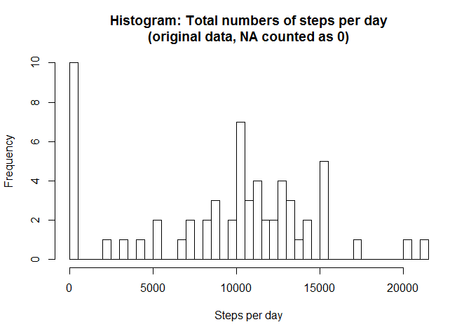
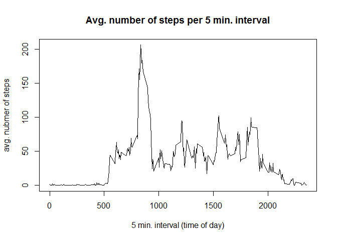
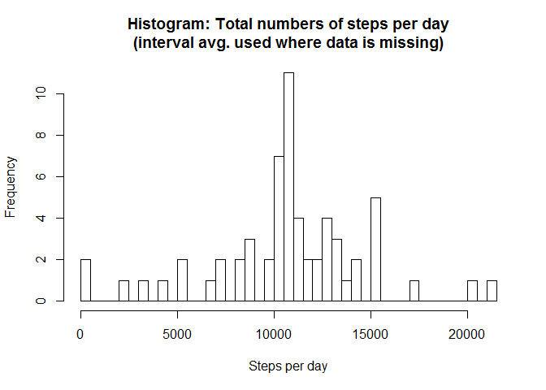

# Reproducible Research: Peer Assessment 1

## Loading and preprocessing the data


```r
library(dplyr)
```

```
## 
## Attaching package: 'dplyr'
## 
## Die folgenden Objekte sind maskiert von 'package:stats':
## 
##     filter, lag
## 
## Die folgenden Objekte sind maskiert von 'package:base':
## 
##     intersect, setdiff, setequal, union
```

```r
activity <- read.csv("activity.csv")
activity_byday <- group_by(activity,date)
activity_byday_total <- summarize(activity_byday, steps = sum(steps, na.rm= TRUE))
activity_byinterval <- group_by(activity,interval)
activity_byinterval_mean <- summarize(activity_byinterval, steps = mean(steps, na.rm= TRUE))
```

## What is mean total number of steps taken per day?
Do address this question a first histogram is drawn. Please note that days with missing data (NA for all intervals of a day) show up in the 0 bin in this histogram.

```r
hist(activity_byday_total$steps, breaks = 50, main = "Histogram: Total numbers of steps per day\n(original data, NA counted as 0)", xlab = "Steps per day")
```

 

The mean and the median for the data are as follows (please note that NA entries are excluded this time).

Mean:

```r
mean(activity_byday_total$steps, na.rm=TRUE)
```

```
## [1] 9354.23
```
Median:

```r
median(activity_byday_total$steps, na.rm=TRUE)
```

```
## [1] 10395
```
Mean and median are similar so the activity seems to be fairly unskewed. This is also confirmed by the histogram.

So on average around 10'000 steps are taken per day.

## What is the average daily activity pattern?
A time series plot shows the average number of steps for every 5 minute interval. NA values have been excluded.

```r
plot(activity_byinterval_mean$interval, activity_byinterval_mean$steps, type = "l", main = "Avg. number of steps per 5 min. interval", xlab ="5 min. interval (time of day)", ylab="avg. nubmer of steps")
```

 
The plot shows a marked peek in the morning (before 10am). The following code is used to precisely identify the 5 minute interval with the max. number of steps (on average):

```r
summarize(activity_byinterval_mean, maxintervalname = interval[which(steps == max(steps))], maxinterval = max(steps))
```

```
## Source: local data frame [1 x 2]
## 
##   maxintervalname maxinterval
##             (int)       (dbl)
## 1             835    206.1698
```
Throughout the day activity is varying until it tampers of in the evening. During the night hardly any steps are reported by the data.


## Imputing missing values
As mentioned earlier there is a certain amount of data missing (intervals for which no data is available).

In a first step the number of invtervals without data will be determined:


```r
sum(is.na(activity$steps))
```

```
## [1] 2304
```

To take care of the missing data the following strategy is devised: If data for an interval is missing for a specific date the average number of steps for that interval will be used instead (the average for that interval over all dates where data is available for this interval).

The following transformations take care of this:

```r
activity_with_mean <- merge(activity, activity_byinterval_mean, by.x = "interval", by.y = "interval")
# creat new colum with filled in values (if necessary)
activity_with_mean <- mutate(activity_with_mean, steps = ifelse(is.na(steps.x), steps.y, steps.x))
# remove columns that will be no longer needed
activity_with_mean <- select(activity_with_mean, -steps.x, -steps.y)
```

The new data table looks like this:

```r
head(activity_with_mean)
```

```
##   interval       date    steps
## 1        0 2012-10-01 1.716981
## 2        0 2012-11-23 0.000000
## 3        0 2012-10-28 0.000000
## 4        0 2012-11-06 0.000000
## 5        0 2012-11-24 0.000000
## 6        0 2012-11-15 0.000000
```
as compared to the orginal data table:

```r
head(activity)
```

```
##   steps       date interval
## 1    NA 2012-10-01        0
## 2    NA 2012-10-01        5
## 3    NA 2012-10-01       10
## 4    NA 2012-10-01       15
## 5    NA 2012-10-01       20
## 6    NA 2012-10-01       25
```
Like for the original data (with missing values) a histgram will now be drawn with the new data set with filled in values. Also, mean and median will be calculated:

```r
# Grouping data by day.
activity_with_mean <- group_by(activity_with_mean,date)
# Calculate daily total and create histogram.
activity_byday_with_mean_total <- summarize(activity_with_mean, steps = sum(steps, na.rm= TRUE))
hist(activity_byday_with_mean_total$steps, breaks = 50, main = "Histogram: Total numbers of steps per day\n(interval avg. used where data is missing)", xlab = "Steps per day")
```

 

Mean:

```r
mean(activity_byday_with_mean_total$steps)
```

```
## [1] 10766.19
```

Median:

```r
median(activity_byday_with_mean_total$steps)
```

```
## [1] 10766.19
```

Using intervall averages to replace the missing values has created a number of perfectly average days. This is so because data has been missing for a number of entire days.

These perfectly average days are now the most frequent days in the data. As a result of this mean and median that have already been close in the orginal data no match.

## Are there differences in activity patterns between weekdays and weekends?
To explore possible differences between activity patterns the data column will be replaced with a new column ("weekday"). This column shows whether the data is from a weekday or from a weekend:


```r
# Are there differences in activity patterns between weekdays and weekends?
activity_fill <- mutate(activity_with_mean, weekday = weekdays(as.Date(date), abbreviate = TRUE))
activity_fill <- mutate(activity_fill, weekday = ifelse(substr(weekday, 1,1) == "S", "weekend", "weekday"))

# Grouping data by interval.
activity_fill <- group_by(activity_fill,interval, weekday)
activity_fill_byinterval <- summarize(activity_fill, steps = mean(steps, na.rm= TRUE))
```

After these transformations the data presents itself as follows:

```r
head(activity_fill_byinterval)
```

```
## Source: local data frame [6 x 3]
## Groups: interval [3]
## 
##   interval weekday      steps
##      (int)   (chr)      (dbl)
## 1        0 weekday 2.25115304
## 2        0 weekend 0.21462264
## 3        5 weekday 0.44528302
## 4        5 weekend 0.04245283
## 5       10 weekday 0.17316562
## 6       10 weekend 0.01650943
```


Based on this data a time series plot is created that allows to compare the activity patterns of weekdays vs. weekends:


```r
library(lattice)
graph <- graph <- xyplot(steps ~ interval | weekday, data = activity_fill_byinterval, type = "l")
update(graph, layout=c(1,2))
```

 

The activity pattern for the to types of weekdays are obviously different:
Both have their peek in the hours up to 10am, but the peak is a lot more pronounced on weekday. This could reflect that the data is from a person who walks to work every morning.

Also there is less activity throughout the day on weekday. This could reflect that the day is spent in an office very little walking is necessary.

Also there is clearly more activity on weekends in the evening (after 8pm). This could be because on weekends evening activities are more frequent than they are during the week.
